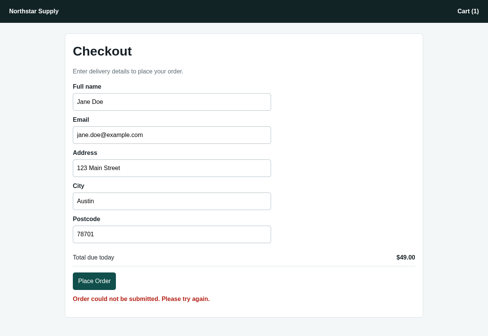
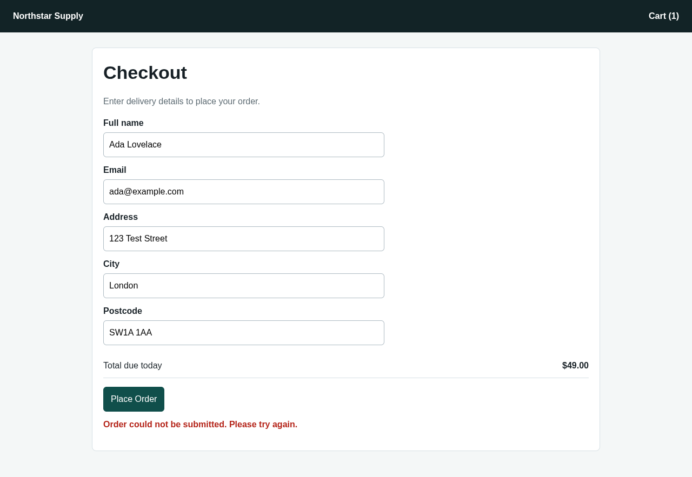

# AgentQA

**Autonomous QA agent built with Solari.**

[](https://www.typescriptlang.org/)
[](https://nodejs.org/)
[](https://getsolari.com)
[](LICENSE)

---

## Overview

AgentQA is an autonomous QA agent that tests a web checkout flow the way a human
tester would — then refuses to file a bug it cannot prove.

A language model drives a recorded [Solari](https://getsolari.com) cloud browser
through a bounded set of tools (navigate, inspect, click, fill, wait,
screenshot). When it believes checkout is broken, it does not write the report.
Instead, a deterministic verifier replays the whole purchase from clean state
three times, an isolated Solari sandbox scores the collected evidence, and only
then does AgentQA emit a self-contained HTML bug report with screenshots, a full
action trace, and a downloadable rrweb session recording.

The goal is a QA report a developer can act on without re-testing it by hand:
every claim in the output is backed by observed page text, a screenshot, and a
reproduction rate.

## Features

- **Autonomous browser navigation** — the model explores the target site through
  a small tool surface instead of a hard-coded script, so the path to checkout is
  discovered rather than replayed.
- **Checkout testing** — product → cart → checkout → form fill → submit, driven
  end to end with plausible test data.
- **Post-submit inspection** — after every submission the agent reads the actual
  rendered page text and classifies the outcome as confirmed failure, successful
  checkout, or inconclusive. No silent assumptions about what "worked" means.
- **Bug detection** — a suspected defect must include severity, expected vs.
  actual behaviour, reproduction steps, and a rationale before it is accepted for
  verification.
- **Screenshot evidence** — full-page captures at submission time and on every
  verification attempt, embedded directly in the report.
- **Three-run verification** — a suspected failure is re-tested three times from
  freshly cleared `localStorage`/`sessionStorage`. Only a 3/3 reproduction is
  reported as confirmed; anything less is labelled inconclusive.
- **Isolated evidence analysis** — trace and verification data are scored by
  Python inside a separate Solari sandbox, keeping the verdict out of the model's
  hands.
- **Session recording** — each run ships an rrweb DOM-level trace of the real
  browser session, linked from the report.

## Architecture

AgentQA splits judgement from proof. The **investigator** is free-form and
model-driven; the **verifier** is deterministic code that the model cannot
influence.

```
                    ┌──────────────────────────────┐
                    │  Solari sandbox (target)     │
                    │  demo-store.html on :8000    │
                    │  → public preview URL        │
                    └──────────────┬───────────────┘
                                   │
                    ┌──────────────▼───────────────┐
   LLM  ◄──tools──► │  INVESTIGATOR                │
  (bounded          │  Recorded Solari browser     │
   turns +          │  navigate · inspect · click  │
   actions)         │  fill · wait · screenshot    │
                    │  → report_suspected_failure  │
                    └──────────────┬───────────────┘
                                   │ suspected finding
                    ┌──────────────▼───────────────┐
                    │  VERIFIER (no model)         │
                    │  3 × checkout from clean     │
                    │  state · post-submit text    │
                    │  → confirmed / succeeded /   │
                    │    inconclusive + screenshot │
                    └──────────────┬───────────────┘
                                   │ trace + attempts
                    ┌──────────────▼───────────────┐
                    │  Solari sandbox (analysis)   │
                    │  Python scores evidence      │
                    │  → confidence, reproduction  │
                    └──────────────┬───────────────┘
                                   │
                    ┌──────────────▼───────────────┐
                    │  agentqa-report.html         │
                    │  + screenshots + rrweb trace │
                    └──────────────────────────────┘
```

**Investigator.** Runs the mission inside a Solari browser launched with
`recording: true`. Every tool call is traced with URL, title, visible text, and
an optional screenshot. Turn and action budgets are enforced, so a confused model
fails fast instead of wandering. The only way out is
`report_suspected_failure` — a structured, validated finding.

**Verifier.** Takes the finding and ignores the model entirely. It reloads the
target, clears storage, and performs the checkout sequence three times, matching
post-submit page text against explicit confirmation and error patterns. Each
attempt yields an outcome, an observation, and a screenshot.

Confidence follows the reproduction rate: `3/3` failures score `0.93` and mark
the report **confirmed**; a partial reproduction scores `0.55`; no reproduction
scores `0.20` and the report is marked **inconclusive**. The two sandboxes run
sequentially — the target is released before the analysis sandbox starts — so a
full run needs only one concurrent sandbox slot.

## Installation

Requires Node.js 20+, a Solari API key, and an OpenAI-compatible API key.

```bash
git clone https://github.com/mustapha-bashiru/solari.git
cd solari/solari-cookbook/showcases/agentqa-ts

npm install
cp .env.example .env
```

Then add your keys to `.env`:

```bash
SOLARI_API_KEY=slr_live_...   # console.getsolari.com
OPENAI_API_KEY=sk-...
```

## Usage

```bash
npm start
```

That's it — AgentQA provisions its own target, so there is nothing to serve
locally. A run prints its progress and finishes with:

```text
report: .../agentqa-report.html
status: confirmed
rrweb trace: https://...
```

Open `agentqa-report.html` in a browser to read the finding.

### Configuration

| Variable | Required | Default | Purpose |
| --- | --- | --- | --- |
| `SOLARI_API_KEY` | yes | — | Solari browsers and sandboxes |
| `OPENAI_API_KEY` | yes | — | Investigator model |
| `OPENAI_BASE_URL` | no | `https://api.openai.com/v1` | Any OpenAI-compatible gateway (e.g. OpenRouter) |
| `OPENAI_MODEL` | no | `gpt-4.1-mini` | Investigator model name |
| `TARGET_URL` | no | bundled demo store | Point AgentQA at another site |
| `AGENTQA_MISSION` | no | `Test checkout as a first-time customer.` | The QA brief |
| `AGENTQA_MAX_TURNS` | no | `12` | Model turn budget |
| `AGENTQA_MAX_ACTIONS` | no | `24` | Browser action budget |

Type-check without spending API credits:

```bash
npm run build
```

## Project structure

```
solari-cookbook/
├── showcases/
│   └── agentqa-ts/                 ← AgentQA
│       ├── index.ts                 Agent, verifier, analysis, report writer
│       ├── demo-store.html          Target store with one seeded checkout defect
│       ├── .env.example             Configuration template
│       ├── package.json             npm install · npm start · npm run build
│       ├── tsconfig.json
│       ├── agentqa-report.html      Generated report (untracked)
│       └── agentqa-artifacts/       Generated screenshots (untracked)
├── examples/                        Upstream Solari Cookbook examples
│   ├── browser-quickstart-ts/
│   ├── browser-profiles-ts/
│   ├── browser-session-recording-py/
│   ├── browser-stealth-proxy-ts/
│   ├── sandbox-quickstart-ts/
│   ├── sandbox-code-interpreter-py/
│   ├── sandbox-port-preview-ts/
│   └── desktop-computer-use-py/
├── LICENSE
└── README.md
```

Reports and screenshots are per-run artifacts and are gitignored.

## Demo

**The report AgentQA generates**

Every run ends in a self-contained HTML file, and the verdict sits at the top:
status, severity, confidence, and reproduction rate, followed by expected vs.
actual behaviour and the target it ran against.

![AgentQA report header: confirmed, high severity, 93% confidence, 3/3 reproduction] (docs/media/solari-cookbook/docs/media/Screenshot 2026-09-04 155543.png)

**Steps and evidence**

Below the verdict is the path the agent actually took, then one evidence card per
verification attempt — each with its own full-page screenshot and the exact
post-submit text that was observed.


**Investigator vs. verifier**

The two halves of a run reached the same defect from different inputs: the agent
picked its own test data, the verifier used its own fixed set. Same error either
way — which is the point, since the failure is not tied to what was typed.

| Investigator | Verifier |
| --- | --- |
|  |  |

All three verifier captures come out byte-for-byte identical, which is what a
deterministic 3/3 reproduction actually looks like.

**End-to-end walkthrough**

A recorded run — the investigator exploring checkout, the three-run
verification, and the generated report — is up on LinkedIn:

**▶ [Watch the AgentQA demo](https://www.linkedin.com/in/bashiru-mustapha-768415307)**

## Example report summary

From a run against the bundled demo store, whose checkout handler intentionally
never reaches the confirmation view:

| | |
| --- | --- |
| **Finding** | Checkout order submission failed |
| **Status** | Confirmed |
| **Severity** | High |
| **Confidence** | 93% |
| **Reproduction** | 3/3 |

**Expected** — successful order placement with an order confirmation
screen/message.

**Actual** — a visible error on submitting the checkout form: *"Order could not
be submitted. Please try again."*

**Investigator** — after completing all required fields (`#name`, `#email`,
`#address`, `#city`, `#postcode`) with plausible test data and clicking **Place
Order**, the order did not complete and the page displayed the submission error.

**Verifier** — 3 explicit failures, 0 successful checkouts, and 0 inconclusive
attempts across 3 fresh attempts, each with its own full-page screenshot.

The checkout error was detected once by the agent and then confirmed in three
independent attempts, which is what promotes it from a suspicion to a reportable
defect.

## Future improvements

- **Multi-flow coverage** — signup, login, search, and returns alongside
  checkout, driven by a mission list rather than a single brief.
- **Regression baselines** — persist reports per commit so AgentQA can report new
  versus known defects instead of re-reporting the same one.
- **CI integration** — a GitHub Action that runs AgentQA on pull requests and
  fails the build on a confirmed critical or high finding.
- **Richer verification** — network and console capture, and accessibility
  assertions alongside the visible-text signal.
- **Parallel verification** — run the three attempts concurrently across browser
  sessions to cut wall-clock time.
- **Adaptive attempts** — escalate to more attempts when the first three are
  inconclusive rather than settling for a low-confidence verdict.
- **Issue filing** — open a GitHub issue directly from a confirmed report, with
  screenshots and the rrweb trace attached.
- **Structured output** — a JSON report alongside the HTML for downstream tools.

## Credits

This project is built on top of the [Solari
Cookbook](https://github.com/solari-sdk/solari-cookbook). AgentQA is my extension
of the original showcase.

Solari resources:

- Docs — [docs.getsolari.com](https://docs.getsolari.com)
- Console — [console.getsolari.com](https://console.getsolari.com)

## License

MIT — see [LICENSE](LICENSE).
